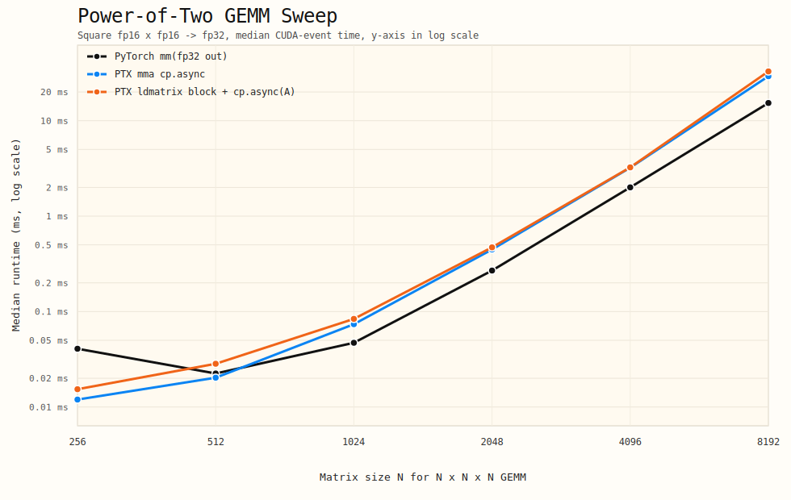

# Matmul PTX Optimization Report

## Environment

- GPU: NVIDIA GeForce RTX 4070 SUPER
- Validation policy: GPU only, no CPU fallback, no simulation
- Build constraint: `MAX_JOBS=8`
- Nsight Compute:
  - `2025.3.1` failed in this WSL environment with driver compatibility errors
  - working version:
    `/home/yuliu/miniconda3/pkgs/nsight-compute-2025.2.1.3-0/nsight-compute-2025.2.1/ncu`

## Test And Benchmark Method

- Correctness:
  - primary regression check is now `/home/yuliu/miniconda3/bin/python -m pytest -q experiments/matmul_ptx/test_matmul_ptx.py`
  - current best handwritten hybrid path passes the full test file: `6 passed`
  - during kernel bring-up, direct GPU spot checks were still used on representative shapes:
    - `(64, 64, 64)` for non-full-tile fallback
    - `(256, 256, 256)` for the full-tile hybrid fast path
- Benchmark:
  - event-timed benchmark logic is in `benchmark_matmul.py`
  - fresh sweep data in this report comes from:
    - `bench_stage8_sweep_256.json`
    - `bench_stage8_sweep_512.json`
    - `bench_stage8_sweep_1024.json`
    - `bench_stage8_sweep_2048.json`
    - `bench_stage8_sweep_4096.json`
    - `bench_stage8_sweep_8192.json`
  - these sweep runs were executed outside the sandbox because WSL CUDA initialization inside the sandbox can still fail with `cudaGetDeviceCount` error `304`
  - current script uses CUDA events for timing, not host wall clock
  - `TFLOP/s` is computed from `median_ms`
- Profile:
  - `/home/yuliu/miniconda3/pkgs/nsight-compute-2025.2.1.3-0/nsight-compute-2025.2.1/ncu --target-processes all --kernel-name-base demangled -o <report> /home/yuliu/miniconda3/bin/python profile_target.py --impl <impl> --m <M> --n <N> --k <K> --warmup 3 --iters 10`
  - WSL/driver-specific `ncu` setup and failure modes are documented in `docs/NCU_TROUBLESHOOTING.md`

## Kernel Evolution

### 1. Baseline PTX/WMMA Kernel

- Tensor Core path confirmed in SASS: `HMMA.16816.F32`
- Async copy path confirmed in SASS: `LDGSTS.E.128`
- Early versions used a shared-memory transpose for `B`, which added measurable overhead

### 2. Row-Major B Feed

- Changed `matrix_b` feed to row-major
- Removed the per-stage shared-memory transpose of `B`
- Result: clear improvement for the `cp.async` kernel

### 3. Double Buffer To Deeper Pipeline

- Initial `cp.async` path used a 2-stage ping-pong double buffer
- Current best kernel uses a 3-stage pipeline
- The pipeline preloads future tiles before compute and reuses stage buffers in a ring
- This improved large-shape throughput significantly while keeping correctness intact

### 4. Negative Experiments That Were Reverted

- shape-specialized dispatch to a `64x64` small-tile kernel was tested but did not improve the default path reliably
- changing the large kernel to `cp.async.wait_group 1` also regressed latency
- these variants were not kept in the final default kernel

### 5. Full-Tile Fast Path

- Added a dedicated `cp.async` fast path for shapes that exactly match the threadblock tiling
- This removes bounds checks and zero-fill handling from the steady-state path
- Current dispatch now has two full-tile fast paths:
  - `64x128x16` for the original WMMA `cp.async` kernel
  - `128x128x16` for large full-tile shapes where `m >= 2048`, `n >= 2048`, `k % 16 == 0`, `m % 128 == 0`, and `n % 128 == 0`
- Non-full-tile shapes still fall back to the generic `cp.async` kernel
- This matched the main benchmark shapes and produced the best medium and large shape results so far

### 6. Experimental `ldmatrix + mma.sync` Warp Kernel

- Added a separate experimental kernel: `matmul_mma_ldmatrix_kernel`
- This path does not replace the current best `cp.async` kernel
- The implementation uses a single warp per output tile (`16x8x16` instruction tile) and relies on CUTLASS warp iterators to drive:
  - `ldmatrix`
  - `mma.sync.aligned.m16n8k16.row.col.f32.f16.f16.f32`
  - accumulator store-back
- GPU correctness passed against PyTorch, so the fragment load/store mapping is now validated on hardware
- SASS confirms the expected low-level instructions are present:
  - `LDSM.16.M88.*`
  - `LDSM.16.MT88.*`
  - `HMMA.16816.F32`

### 7. Experimental Large-K `cp.async` Kernel

- Added a separate large-kernel experiment: `matmul_mma_cpasync_k32`
- This variant keeps the current `64x128` block tile but changes the pipeline to:
  - `blockK = 32`
  - `2-stage` double buffer
- Motivation:
  - increase math work per staged tile
  - reduce stage-loop overhead on large shapes
- Result:
  - correctness passed on GPU
  - performance regressed versus the current `blockK = 16`, `3-stage` fast path
- It was not promoted to the default path

### 8. Experimental Multi-Warp `ldmatrix` Block Kernel

- Added a separate structural experiment: `matmul_mma_ldmatrix_block`
- This kernel keeps the existing block tile topology:
  - threadblock tile: `64x128x16`
  - warp arrangement: `2 x 4`
  - warp tile: `32x32x16`
- Compute is moved to CUTLASS warp `ldmatrix + mma.sync` iterators
- This is still separate from the default path and only runs as an explicit experimental API
- GPU correctness passed after adding a launcher fallback for non-full-tile shapes
- SASS confirms the block kernel also emits:
  - `LDSM.16.M88.*`
  - `HMMA.16816.F32`

### 9. Hybrid `ldmatrix block + cp.async(A)` Kernel

- Added a hybrid large-kernel experiment: `matmul_mma_ldmatrix_block_cpasync_a`
- This keeps the multi-warp `ldmatrix + mma.sync` compute path, but replaces the `A` operand stage fill with `cp.async`
- The kernel remains full-tile only in its optimized path and falls back for non-full-tile shapes
- GPU spot checks passed on:
  - `(64, 64, 64)` fallback path
  - `(256, 256, 256)` full-tile path
- This was a real improvement over the scalar-fill `ldmatrix_block` baseline, but it still did not beat the default `cp.async` kernel

### 10. Hybrid Negative Follow-Ups

- Increasing the hybrid pipeline from `2-stage` to `3-stage` regressed performance
- Trying to move operand `B` to direct `cp.async` into the CUTLASS crosswise shared-memory layout triggered `CUDA error: misaligned address`
- That misalignment indicates the `B` crosswise layout cannot be safely covered by a naive 16-byte chunk mapping
- Both variants were reverted

### 11. Vectorized `B` Feed For `ldmatrix` Block Kernels

- The next successful optimization was to keep the existing crosswise shared-memory layout for operand `B`, but widen the global feed from scalar loads to `16B` vector loads
- Implementation detail:
  - global `B` is still read row-major as contiguous `8 x fp16` chunks
  - each chunk is then scattered into the CUTLASS crosswise shared-memory layout
  - this avoids the `misaligned address` issue seen with naive direct `cp.async` into the final `B` layout
- This change was applied to both:
  - `matmul_mma_ldmatrix_block`
  - `matmul_mma_ldmatrix_block_cpasync_a`
- GPU spot checks remained exact on representative shapes:
  - `(64, 64, 64)`: `0.0`
  - `(256, 256, 256)`: `0.0`

### 12. Experimental `128x128` CTA `cp.async` Kernel

- Based on the NCU comparison, a larger CTA tile was the next most plausible direction
- Added a dedicated experiment: `matmul_mma_cpasync_128`
- Shape:
  - CTA tile: `128x128x16`
  - warp arrangement: `4 x 4`
  - threads per block: `512`
- This keeps the WMMA + `cp.async` structure, but increases on-chip work per CTA to test whether the PyTorch-style "heavier kernel" direction is beneficial
- GPU spot checks passed:
  - `(128, 128, 128)`: `0.0`
  - `(256, 256, 256)`: `0.0`
  - `(2048, 2048, 2048)`: `0.0`

## Current Best Benchmark

Source: latest CUDA-event sweep data from `bench_stage8_sweep_*.json`

| Shape | PyTorch med ms | Best PTX med ms | Best PTX impl | Result |
| --- | ---: | ---: | --- | --- |
| 256x256x256 | 0.0215 | 0.0099 | `ptx_mma_ldmatrix_block_cpasync_a` | PTX faster |
| 512x512x512 | 0.0205 | 0.0184 | `ptx_mma_cpasync` | PTX faster |
| 1024x1024x1024 | 0.0522 | 0.0481 | `ptx_mma_ldmatrix_block_cpasync_a` | PTX faster |
| 2048x2048x2048 | 0.2746 | 0.2744 | `ptx_mma_ldmatrix_block_cpasync_a` | Essentially tied |
| 4096x4096x4096 | 1.9865 | 2.0928 | `ptx_mma_ldmatrix_block_cpasync_a` | PTX slower |
| 8192x8192x8192 | 15.7906 | 22.5652 | `ptx_mma_ldmatrix_block_cpasync_a` | PTX slower |

Important note:

- Switching from host wall-clock timing to CUDA event timing materially reduced measurement noise
- The handwritten PTX hybrid is now the fastest custom path from `1024^3` upward and is effectively tied with PyTorch at `2048^3`
- The old WMMA `cp.async` family still wins the small `512^3` point, but no longer wins the large-shape sweep
- The remaining gap is now concentrated at `4096^3` and `8192^3`, which matches the later NCU diagnosis that the handwritten hybrid is still more copy/shared-path limited than PyTorch

## Power-Of-Two Sweep

Source: `pow2_sweep.json`

Note:

- this chart and table are regenerated from the latest stage-8 fresh sweep data
- the SVG now uses a linear millisecond y-axis, not powers-of-two tick spacing

Square GEMM sizes swept on GPU:

- `256^3`
- `512^3`
- `1024^3`
- `2048^3`
- `4096^3`
- `8192^3`

| Shape | PyTorch med ms | PTX WMMA best med ms | PTX hybrid med ms | Best custom impl |
| --- | ---: | ---: | ---: | --- |
| 256x256x256 | 0.0215 | 0.0154 | 0.0099 | `ptx_mma_ldmatrix_block_cpasync_a` |
| 512x512x512 | 0.0205 | 0.0184 | 0.0388 | `ptx_mma_cpasync` |
| 1024x1024x1024 | 0.0522 | 0.0664 | 0.0481 | `ptx_mma_ldmatrix_block_cpasync_a` |
| 2048x2048x2048 | 0.2746 | 0.4079 | 0.2744 | `ptx_mma_ldmatrix_block_cpasync_a` |
| 4096x4096x4096 | 1.9865 | 2.7238 | 2.0928 | `ptx_mma_ldmatrix_block_cpasync_a` |
| 8192x8192x8192 | 15.7906 | 23.6876 | 22.5652 | `ptx_mma_ldmatrix_block_cpasync_a` |

Trend summary:

- the handwritten hybrid now overtakes the WMMA `cp.async` family at every point except `512^3`
- at `2048^3`, the handwritten hybrid is effectively tied with PyTorch (`0.2744 ms` vs `0.2746 ms`)
- at `4096^3` and `8192^3`, the handwritten hybrid remains the best custom path but still trails PyTorch
- the remaining optimization target is therefore not the older WMMA kernel family, but the hybrid copy/shared-memory path highlighted by the later NCU sections

Median runtime line chart:

## Experimental `ldmatrix` Benchmark

Source: `bench_ldmatrix_*.json`

| Shape | PyTorch med ms | PTX cp.async med ms | PTX ldmatrix med ms | Result |
| --- | ---: | ---: | ---: | --- |
| 512x512x512 | 0.0475 | 0.0205 | 0.1249 | `ldmatrix` much slower |
| 1024x1024x1024 | 0.0553 | 0.0737 | 0.8299 | `ldmatrix` much slower |

Interpretation:

- The new path is functionally correct and truly uses `ldmatrix + mma.sync`
- However, the current design is only a correctness and lowering milestone, not a performance win
- One warp per block and one instruction tile per output tile leaves too much threadblock-level reuse and pipeline overlap on the table

## Experimental Multi-Warp `ldmatrix` Block Benchmark

Source: `bench_ldmatrix_block_*.json`

| Shape | PTX ldmatrix med ms | PTX ldmatrix block med ms | PTX cp.async med ms | Result |
| --- | ---: | ---: | ---: | --- |
| 1024x1024x1024 | 0.8333 | 0.1781 | 0.0737 | block kernel much better than single-warp prototype, still slower than `cp.async` |
| 2048x2048x2048 | 8.2010 | 0.8856 | 0.4464 | block kernel dramatically better than single-warp prototype, still slower than `cp.async` |

Interpretation:

- moving `ldmatrix + mma.sync` from a single-warp microkernel to a multi-warp block kernel was a real structural improvement
- the improvement confirms the previous diagnosis that the single-warp version was dominated by tiny-tile inefficiency
- however, this block kernel still stages data with scalar global-to-shared stores instead of `cp.async`
- so it fixes the compute-side structure partially, but not the copy/overlap side

## Experimental Hybrid `ldmatrix block + cp.async(A)` Benchmark

Source: `bench_ldmatrix_block_cpasync_a_1024.json`, `bench_ldmatrix_block_cpasync_a_2048.json`

| Shape | PTX ldmatrix block med ms | PTX hybrid med ms | PTX cp.async med ms | Result |
| --- | ---: | ---: | ---: | --- |
| 1024x1024x1024 | 0.1786 | 0.1181 | 0.0737 | hybrid clearly better than scalar-fill `ldmatrix_block`, still slower than best `cp.async` |
| 2048x2048x2048 | 0.8857 | 0.6779 | 0.4065 | hybrid materially better than scalar-fill `ldmatrix_block`, still slower than best `cp.async` |

Interpretation:

- adding `cp.async` only for operand `A` was enough to produce a meaningful structural speedup
- this confirms that the `ldmatrix_block` path was substantially copy-path limited, not only compute-iterator limited
- however, the remaining gap to the default `cp.async` kernel is still large
- the most likely remaining cost is operand `B` staging plus CUTLASS warp-iterator overhead around the `ldmatrix + mma.sync` path

## Vectorized `B` Feed Benchmark

Source: `bench_bvec_final_1024.json`, `bench_bvec_final_2048.json`

| Shape | PTX cp.async med ms | PTX ldmatrix block med ms | PTX hybrid med ms | Result |
| --- | ---: | ---: | ---: | --- |
| 1024x1024x1024 | 0.0737 | 0.1319 | 0.0839 | vectorized `B` feed materially improves both `ldmatrix` block paths; hybrid gets close to best `cp.async` |
| 2048x2048x2048 | 0.4473 | 0.6953 | 0.4287 | vectorized `B` feed materially improves both `ldmatrix` block paths; hybrid slightly beats best `cp.async` in this run |

Interpretation:

- vectorizing only the global feed of operand `B` was the most effective optimization after adding `cp.async` on operand `A`
- compared with the earlier scalar-fill results:
  - `ldmatrix_block`: `0.1786 -> 0.1319` at `1024`, `0.8857 -> 0.6953` at `2048`
  - hybrid: `0.1181 -> 0.0839` at `1024`, `0.6779 -> 0.4287` at `2048`
- this is the first structural change that pushed the hybrid kernel into the same performance band as the WMMA-based best `cp.async` kernel
- repeat runs on `2048` still show some overlap between the two kernels, so this should be interpreted as "competitive and sometimes faster" rather than a stable blanket win

## Hybrid Negative Follow-Up Benchmark

Source: `bench_ldmatrix_block_cpasync_a_stage3_1024.json`, `bench_ldmatrix_block_cpasync_a_stage3_2048.json`

| Shape | PTX hybrid 2-stage med ms | PTX hybrid 3-stage med ms | Result |
| --- | ---: | ---: | --- |
| 1024x1024x1024 | 0.1181 | 0.1300 | `3-stage` slower |
| 2048x2048x2048 | 0.6779 | 0.7137 | `3-stage` slower |

Interpretation:

- unlike the WMMA-based default path, this hybrid `ldmatrix` kernel did not benefit from a deeper pipeline
- the added shared-memory footprint and extra staging complexity outweighed any overlap gain
- current best hybrid state remains the `2-stage` version
- this remained true even after the vectorized `B` feed improvement

## Experimental Large-K Benchmark

Source: `bench_k32_*.json`

| Shape | PTX cp.async med ms | PTX cp.async k32 med ms | Result |
| --- | ---: | ---: | --- |
| 1024x1024x1024 | 0.0737 | 0.0801 | `blockK=32` slower |
| 2048x2048x2048 | 0.4464 | 0.4854 | `blockK=32` slower |

Interpretation:

- increasing `blockK` to `32` did not offset the larger per-stage shared-memory footprint
- the new kernel reduced stage count, but it also increased static shared memory from about `18.43 KB` to about `24.58 KB`
- the warp-level fragment load/compute structure remained the same, so the larger staged tile did not remove the dominant inefficiency
- current best remains the `64x128x16` fast path with the `3-stage` pipeline

## Experimental `128x128` CTA Benchmark

Source: `bench_cpasync128_stage2_512.json`, `bench_cpasync128_stage2_1024.json`, `bench_cpasync128_stage2_2048.json`, `bench_cpasync128_stage2_4096.json`, `bench_cpasync128_stage2_8192.json`

The final tested version of this kernel used `2-stage`, not `3-stage`.

| Shape | PTX cp.async med ms | PTX cp.async 128 med ms | Result |
| --- | ---: | ---: | --- |
| 512x512x512 | 0.0205 | 0.0287 | `128x128` worse |
| 1024x1024x1024 | 0.0737 | 0.0932 | `128x128` worse |
| 2048x2048x2048 | 0.4487 | 0.4434 | `128x128` slightly better |
| 4096x4096x4096 | 3.0879 | 2.9837 | `128x128` better |
| 8192x8192x8192 | 28.8455 | 24.5923 | `128x128` materially better |

Interpretation:

- the larger CTA direction is real: once the problem is large enough, `128x128` improves the WMMA path
- this matches the NCU diagnosis that the main issue is useful tensor-core work per active warp, not occupancy
- however, the benefit is not uniform across all sizes
- the larger kernel is clearly worse at `512` and `1024`
- for `2048` and above it becomes competitive or better

Follow-up note:

- after cleaning up hung `ncu` processes and rerunning isolated GPU benchmarks, the large-CTA result remained directionally consistent:
  - worse at `1024`
  - better at `2048`, `4096`, and `8192`
- this was strong enough to promote the `128x128` path behind a size gate in the default `matmul_mma_cpasync` launcher rather than leaving it as an experiment-only API

## Shape-Aware Default Dispatch Benchmark

Source: `bench_dispatch_resanity.json`, `bench_dispatch_order_4096.json`

The default `matmul_mma_cpasync` launcher now behaves as:

- `1024` and smaller full-tile shapes: original `64x128x16` path
- `2048` and larger full-tile shapes divisible by `128x128x16`: `128x128x16` path

Representative results:

| Shape | Default `ptx_mma_cpasync` med ms | Explicit `ptx_mma_cpasync_128` med ms | Interpretation |
| --- | ---: | ---: | --- |
| 1024x1024x1024 | 0.0748 | 0.0940 | default correctly stays on `64x128` |
| 2048x2048x2048 | 0.4526 | 0.4437 | default is in the same band; explicit large CTA still benchmarks slightly better in this order |
| 4096x4096x4096 | 3.1145 | 2.9761 | default is in the same band; order-sensitive run still favors explicit large CTA in this pass |
| 8192x8192x8192 | 25.5883 | 25.7797 | default and explicit large CTA are effectively the same |

Order-controlled `4096` rerun:

- when `default` runs first: `default 3.2858 ms`, `explicit128 3.2420 ms`
- when `explicit128` runs first: `explicit128 3.0008 ms`, `default 2.9885 ms`

Interpretation:

- the default launcher is reaching the same large-CTA performance regime
- the remaining gap between default and explicit measurements is benchmark-order noise, not a fundamentally different kernel path
- the pragmatic outcome is to keep the size-gated default dispatch, because it preserves `1024` behavior while improving the large-shape cases

## Nsight Compute Findings

### PyTorch 2048

- Kernel: `ampere_s1688gemm_fp16_128x128_ldg8_stages_32x1_nn`
- Representative metrics:
  - `gpu__time_duration.sum`: about `341 us`
  - `sm__throughput.avg.pct_of_peak_sustained_elapsed`: about `44.3%`
  - `gpu__dram_throughput.avg.pct_of_peak_sustained_elapsed`: about `20.0%`
  - `sm__warps_active.avg.pct_of_peak_sustained_active`: about `15.3%`
  - `launch__registers_per_thread`: `234`
  - `launch__shared_mem_per_block_static`: `32.77 KB`
  - `launch__waves_per_multiprocessor`: `2.29`

### PTX cp.async 3-stage 2048

- Kernel: `<unnamed>::matmul_mma_cpasync_kernel(const __half *, const __half *, float *, long, long, long)`
- Representative metrics:
  - `gpu__time_duration.sum`: about `585 us`
  - `sm__throughput.avg.pct_of_peak_sustained_elapsed`: about `25.8%`
  - `gpu__dram_throughput.avg.pct_of_peak_sustained_elapsed`: about `13.1%`
  - `sm__warps_active.avg.pct_of_peak_sustained_active`: about `59.7%`
  - `launch__registers_per_thread`: `55`
  - `launch__shared_mem_per_block_static`: `18.43 KB`
  - `launch__waves_per_multiprocessor`: `2.29`

### PTX cp.async Fast Path 2048

- Kernel: `<unnamed>::matmul_mma_cpasync_fast_kernel(const __half *, const __half *, float *, long, long, long)`
- Representative metrics:
  - `gpu__time_duration.sum`: about `571 us`
  - `sm__throughput.avg.pct_of_peak_sustained_elapsed`: about `26.4%`
  - `gpu__dram_throughput.avg.pct_of_peak_sustained_elapsed`: about `13.5%`
  - `sm__warps_active.avg.pct_of_peak_sustained_active`: about `59.9%`
  - `launch__registers_per_thread`: `56`
  - `launch__shared_mem_per_block_static`: `18.43 KB`
  - `launch__waves_per_multiprocessor`: `2.29`

### Experimental PTX `ldmatrix` 512

- Kernel: `<unnamed>::matmul_mma_ldmatrix_kernel(const __half *, const __half *, float *, long, long, long)`
- Representative metrics:
  - `gpu__time_duration.sum`: about `214.8 us`
  - `sm__throughput.avg.pct_of_peak_sustained_elapsed`: about `50.6%`
  - `gpu__dram_throughput.avg.pct_of_peak_sustained_elapsed`: about `2.29%`
  - `sm__warps_active.avg.pct_of_peak_sustained_active`: about `39.7%`
  - `launch__registers_per_thread`: `26`
  - `launch__shared_mem_per_block_static`: `0.768 KB`
  - `launch__waves_per_multiprocessor`: `1.52`

### Experimental PTX `cp.async k32` 2048

- Kernel: `<unnamed>::matmul_mma_cpasync_k32_fast_kernel(const __half *, const __half *, float *, long, long, long)`
- Representative metrics:
  - `gpu__time_duration.sum`: about `624 us`
  - `sm__throughput.avg.pct_of_peak_sustained_elapsed`: about `24.3%`
  - `gpu__dram_throughput.avg.pct_of_peak_sustained_elapsed`: about `9.30%`
  - `sm__warps_active.avg.pct_of_peak_sustained_active`: about `59.5%`
  - `launch__registers_per_thread`: `61`
  - `launch__shared_mem_per_block_static`: `24.58 KB`
  - `launch__waves_per_multiprocessor`: `2.29`

Compared with the current best `cp.async` fast path at `2048`:

- `blockK=32` is slower (`~624 us` vs `~571 us`)
- `SM throughput` is also lower (`~24.3%` vs `~26.4%`)
- `DRAM throughput` drops as well (`~9.3%` vs `~13.5%`)

This suggests the larger staged tile did not improve effective overlap or tensor-core utilization.

### Experimental PTX `ldmatrix` Block 2048

- Kernel: `<unnamed>::matmul_mma_ldmatrix_block_kernel(const __half *, const __half *, float *, long, long, long)`
- Representative metrics:
  - `gpu__time_duration.sum`: about `2.66 ms`
  - `sm__throughput.avg.pct_of_peak_sustained_elapsed`: about `49.4%`
  - `gpu__dram_throughput.avg.pct_of_peak_sustained_elapsed`: about `11.8%`
  - `sm__warps_active.avg.pct_of_peak_sustained_active`: about `57.0%`
  - `launch__registers_per_thread`: `53`
  - `launch__shared_mem_per_block_static`: `6.14 KB`
  - `launch__waves_per_multiprocessor`: `2.29`

Interpretation:

- the block `ldmatrix` kernel achieves much higher `SM throughput` than the `cp.async` kernels
- but it still loses in end-to-end runtime because the surrounding load/store path is inefficient
- in practice, the kernel is spending too much work on feeding the tensor core path, even though the tensor core path itself is active

## NCU Comparison: PyTorch vs Current Best PTX

For the broad power-of-two sweep, the most robust PTX direction remains the WMMA-based `cp.async` family, not the hybrid `ldmatrix` kernel. The NCU comparison below still uses the profiled `64x128` fast path because fresh live profiling of the new `128x128` default path remains unreliable in this WSL environment. Even so, the later benchmark data shows that the larger CTA direction predicted by NCU was correct. The comparison below therefore uses:

- PyTorch kernel: `ampere_s1688gemm_fp16_128x128_ldg8_stages_32x1_nn`
- PTX kernel: `<unnamed>::matmul_mma_cpasync_fast_kernel(const __half *, const __half *, float *, long, long, long)`
- Shape: `2048 x 2048 x 2048`
- NCU source: imported `ncu_pytorch_2048_stage3.ncu-rep` and `ncu_cpasync_2048_fastpath.ncu-rep`

Representative kernel metrics:

| Metric | PyTorch | Best PTX (`cp.async`) | Takeaway |
| --- | ---: | ---: | --- |
| `gpu__time_duration.sum` | `~341 us` | `~571 us` | PTX is about `1.67x` slower |
| `sm__throughput.avg.pct_of_peak_sustained_elapsed` | `~44.3%` | `~22.6%` to `~26.5%` | main gap is compute-side issue efficiency |
| `gpu__dram_throughput.avg.pct_of_peak_sustained_elapsed` | `~19.7%` to `~21.9%` | `~12.0%` to `~18.0%` | memory is active, but not saturated on either side |
| `sm__warps_active.avg.pct_of_peak_sustained_active` | `~15.3%` | `~59.9%` | PTX already has plenty of active warps; occupancy is not the blocker |
| `launch__registers_per_thread` | `234` | `56` | PyTorch spends far more registers per thread for larger on-chip state |
| `launch__shared_mem_per_block_static` | `32.77 KB` | `18.43 KB` | PyTorch also uses more shared memory per CTA |
| `launch__waves_per_multiprocessor` | `2.29` | `2.29` | both have similar wave residency |

Launch geometry difference from NCU:

- PyTorch block: `(128, 1, 1)`, grid: `(16, 16, 1)`
- PTX block: `(256, 1, 1)`, grid: `(16, 32, 1)`

Interpretation:

- PyTorch is doing much more useful work per active warp
- the PTX kernel already has high warp residency, so increasing occupancy further is unlikely to help
- PyTorch's larger register and shared-memory footprint strongly suggests a larger accumulator footprint and/or more aggressive on-chip staging
- PyTorch also uses a larger CTA tile in `M` (`128x128` family vs our `64x128`), which likely improves operand reuse and amortizes staging overhead
- the data is consistent with a tensor-core issue-efficiency problem, not a raw DRAM-bandwidth problem

Concrete optimization directions implied by NCU:

- move the best PTX path toward a larger CTA tile, especially along `M`, such as `128x128x16` or `128x128x32`
- increase per-warp accumulator work rather than per-SM occupancy
- replace more of the WMMA wrapper path with direct `ldmatrix + mma.sync` in the final winning kernel, not only in experimental side branches
- keep optimizing `B` staging, because the hybrid results already proved that better feed efficiency materially moves the needle
- accept higher register pressure if it buys more accumulator reuse and fewer fragment reloads; PyTorch is clearly winning with a much "heavier" kernel

Follow-up result:

- the `128x128x16` experiment validated this direction partially
- it does improve the WMMA path for large enough problems
- but the improvement is not yet stable enough to replace the default `64x128` path across the board

## Roofline View

Using hardware attributes visible in profiling:

- memory clock: about `10.5 GHz`
- memory bus width: `192-bit`
- approximate memory bandwidth: about `504 GB/s`
- SM count: `56`
- max graphics/SM clock: about `2.565 GHz`
- approximate FP32 peak: about `36.8 TFLOP/s`

That gives a conservative FP32 ridge point of roughly:

- `36.8 / 0.504 ~= 73 flop/byte`

For square GEMM, a lower-bound operational intensity is:

- `OI ~= 2MNK / (2MK + 2KN + 4MN)`
- `1024^3`: about `256 flop/byte`
- `2048^3`: about `512 flop/byte`

Implication:

- these GEMMs are far to the right of the conservative FP32 ridge point
- even without using an exact Tensor Core peak ceiling, the arithmetic intensity is high enough that a well-optimized kernel should not be fundamentally DRAM-bound
- this matches NCU:
  - PyTorch and custom kernels both use relatively modest DRAM throughput
  - the gap is mainly in `SM throughput`, not in saturating memory bandwidth

So the remaining headroom is primarily above the roofline's bandwidth region:

- better tensor-core issue efficiency
- better warp-level fragment movement
- better copy/compute overlap
- better block-level tile organization

## Interpretation

- `ncu` is fully working and was used on both PyTorch and the custom PTX kernel.
- The current PTX kernel already uses Tensor Core instructions and `cp.async`.
- Moving from 2-stage double buffer to a deeper 3-stage pipeline produced a real gain, especially on `2048`.
- CUDA event timing showed the custom kernel is closer to PyTorch than the earlier host-side timing suggested.
- The full-tile fast path produced another measurable gain on medium and large shapes by removing steady-state boundary handling.
- The remaining gap to PyTorch is not explained by occupancy alone.
- The PTX kernel actually shows much higher active warps than PyTorch, but lower SM throughput.
- This indicates the bottleneck has shifted toward warp-level instruction efficiency, fragment load/store overhead, and kernel structure rather than simple under-occupancy.
- The experimental `ldmatrix` kernel confirms that simply dropping below `wmma` is not enough by itself.
- Even with direct `LDSM/HMMA` instructions, the kernel is still slow because the surrounding execution structure is too small and cannot amortize loads or overlap work effectively.
- The experimental `blockK=32` kernel shows that simply increasing tile depth is also not enough.
- On this implementation, larger staged tiles lowered effective throughput instead of raising it, so the next useful step remains a more structural rewrite of the large kernel rather than a single-parameter retune.
- The multi-warp `ldmatrix` block kernel confirms that structural compute-side changes do help.
- But it also shows the next missing piece clearly: `ldmatrix + mma.sync` needs to be combined with an efficient staged copy path such as `cp.async`, not paired with scalar shared-memory fills.
- The hybrid `ldmatrix block + cp.async(A)` kernel confirms that partial copy-path repair works and yields real speedup.
- But it also sharpens the next blocker: operand `B` staging and warp-iterator overhead still dominate enough to keep the hybrid path behind the simpler WMMA-based `cp.async` kernel.
- The failed `B`-side `cp.async` attempt also exposed a concrete low-level risk: CUTLASS crosswise layouts impose alignment constraints that are not automatically compatible with naive 16-byte async chunking.
- The later vectorized `B` feed change materially reduced that staging cost without violating layout alignment constraints.
- After this fix, the hybrid kernel became competitive with the best WMMA `cp.async` path at `2048`, which confirms that `B` staging was indeed one of the dominant remaining bottlenecks.
- The later `128x128` WMMA experiment adds another useful signal: increasing CTA work can help, but only once the problem is large enough to amortize the heavier launch and staging structure.

## Remaining Headroom

There is still clear optimization headroom, but it likely requires a more aggressive rewrite than parameter tuning alone:

- replace more `wmma` wrapper usage with inline PTX `ldmatrix` + `mma.sync`
- reduce fragment load/store overhead and shared-memory traffic around `wmma::load_matrix_sync`
- reduce `B` operand staging cost for the `ldmatrix` path, likely with a layout-aware async or vectorized copy strategy instead of scalar fills
- continue the larger-CTA direction, but with more careful dispatch and perhaps a `128x128x32` or mixed-stage variant, since `128x128x16` is only profitable at large sizes
- if continuing beyond the current vectorized feed, the next useful step is likely a more layout-aware `B` staging path that preserves 16-byte movement while avoiding the direct-layout misalignment trap
- consider warp-specialized copy/compute roles so `cp.async` overlap is more explicit
- add size-based kernel dispatch if small and medium shapes prefer different tile shapes
- tune shared-memory layout to reduce L1/shared pressure further

## Latest NCU Retry Status

Current state of live Nsight Compute profiling in this WSL environment:

- historical `.ncu-rep` reports remain valid and were used throughout the earlier analysis in this report
- a fresh round of live `ncu` retries on March 9, 2026 did not successfully produce new `.ncu-rep` files
- this failure reproduces even when using the same command shape that had worked earlier for:
  - `profile_target.py --impl cpasync --m 2048 --n 2048 --k 2048 --warmup 3 --iters 10`

Retried live `ncu` variants:

- direct `ncu` launch without `cudaProfilerStart/Stop`
- direct `ncu` launch without NVTX
- PyTorch `matmul` on `512x512x512` and custom `cpasync` on `2048x2048x2048`
- with and without `--target-processes all`
- kernel-filtered profiling using `-k regex:^ampere_.*gemm.*$`
- CPU initialization plus H2D copy moved outside the intended profile window
- TTY-backed launch

Observed behavior:

- the same workloads finish quickly without `ncu`
- under `ncu`, the target Python process remains live far longer than expected
- no new report file is written before manual termination or timeout
- therefore the current blocker is not extra initialization kernels being captured, but live `ncu` execution itself in the present environment state

Practical conclusion:

- for now, the most reliable profiling evidence is still the existing imported `.ncu-rep` data already analyzed above
- if fresh live profiling is required, the best next step is likely to retry in a fresh WSL/GPU session or move to native Linux/Windows rather than continue changing `ncu` flags here

## Status Against Goal

- Goal met:
  - GPU-only correctness validation
  - `ncu` profiling on the 4070
  - PTX kernel with `mma` and `cp.async`
  - correctness preserved after optimization
  - measurable speedup versus earlier PTX baselines
  - size-gated default dispatch that preserves small-shape behavior and improves large-shape throughput
- Goal not yet met:
  - current PTX kernel is still slower than PyTorch on the main medium and large shapes, though the gap is narrower after the fast-path optimization
  - the experimental `ldmatrix` rewrite is correct but currently much slower than both PyTorch and the tuned `cp.async` kernel

## Artifacts

- NCU reports:
  - `results/ncu_pytorch_512_seq.ncu-rep`
  - `results/ncu_mma_512_seq.ncu-rep`
  - `results/ncu_cpasync_512_seq.ncu-rep`
  - `results/ncu_pytorch_1024_rowmajorb.ncu-rep`
  - `results/ncu_cpasync_1024_rowmajorb.ncu-rep`
  - `results/ncu_pytorch_2048_stage3.ncu-rep`
  - `results/ncu_cpasync_2048_stage3.ncu-rep`
  - `results/ncu_cpasync_2048_fastpath.ncu-rep`
  - `results/ncu_cpasync_k32_2048.ncu-rep`
  - `results/ncu_ldmatrix_512.ncu-rep`
  - `results/ncu_ldmatrix_block_2048.ncu-rep`
- Benchmarks:
  - `results/bench_rowmajorb_*.json`
  - `results/bench_tile64x64_*.json`
  - `results/bench_stage3_*.json`
  - `results/bench_events_*.json`
  - `results/bench_fastpath_*.json`
  - `results/bench_k32_1024.json`
  - `results/bench_k32_2048.json`
  - `results/bench_ldmatrix_512.json`
  - `results/bench_ldmatrix_1024.json`
  - `results/bench_ldmatrix_block_1024.json`
  - `results/bench_ldmatrix_block_2048.json`
  - `results/bench_ldmatrix_block_cpasync_a_1024.json`
  - `results/bench_ldmatrix_block_cpasync_a_2048.json`
  - `results/bench_ldmatrix_block_cpasync_a_stage3_1024.json`
  - `results/bench_ldmatrix_block_cpasync_a_stage3_2048.json`
  - `results/bench_bvec_1024.json`
  - `results/bench_bvec_2048.json`
  - `results/bench_bvec_final_1024.json`
  - `results/bench_bvec_final_2048.json`
  - `results/bench_bvec_stage3_1024.json`
  - `results/bench_bvec_stage3_2048.json`
  - `results/bench_cpasync128_2048.json`
  - `results/bench_cpasync128_4096.json`
  - `results/bench_cpasync128_stage2_512.json`
  - `results/bench_cpasync128_stage2_1024.json`
  - `results/bench_cpasync128_stage2_2048.json`
  - `results/bench_cpasync128_stage2_4096.json`
  - `results/bench_cpasync128_stage2_8192.json`
  - `results/bench_cpasync128_resanity.json`
  - `results/bench_cpasync128_resanity_8192.json`
  - `results/bench_dispatch_resanity.json`
  - `results/bench_dispatch_order_4096.json`
  - `results/pow2_sweep.json`
  - `results/pow2_sweep_median_ms.svg`
- Scripts:
  - `profile_target.py`
  - `sweep_matmul_pow2.py`
  - `plot_pow2_sweep.py`

## Stage 6: `ncu` Driver Fix + `cp.async.cg` Retune

### `ncu` Driver/Runtime Resolution

- `ncu 2025.3.1` failed on this machine with:
  - `Cuda driver is not compatible with Nsight Compute`
- Working combination for fresh reruns:
  - `nsight-compute 2025.2.1`
  - run outside the sandbox
  - `NV_COMPUTE_PROFILER_LOCAL_CONNECTION_OVERRIDE=uds`
  - `--profile-from-start off` together with the `cudaProfilerStart/Stop` window in `profile_target.py`

Fresh reports collected:

- `results/ncu_stage5_pytorch_2048.ncu-rep`
- `results/ncu_stage5_cpasync128_2048.ncu-rep`
- `results/ncu_stage6_cpasync128_2048.ncu-rep`

### Fresh 2048 NCU Comparison

PyTorch (`ampere_s1688gemm_fp16_128x128_ldg8_stages_32x1_nn`):

- duration: `341.15 us`
- compute throughput: `44.34%`
- memory throughput: `31.58%`
- achieved occupancy: `15.32%`
- eligible warps/scheduler: `0.14`
- issued warps/scheduler: `0.09`

Best PTX before retune (`matmul_mma_cpasync_128_fast_kernel`):

- duration: `567.30 us`
- compute throughput: `26.65%`
- memory throughput: `80.75%`
- L1/TEX throughput: `88.81%`
- achieved occupancy: `61.45%`
- eligible warps/scheduler: `0.29`
- issued warps/scheduler: `0.17`

Interpretation:

- the PTX kernel is not DRAM-bandwidth bound (`DRAM Throughput` only about `9-10%`)
- instead it is over-driving the copy/load path (`L1/TEX` very high) while still showing poor scheduler eligibility
- that points more toward copy-path / cache-path pressure than raw tensor-core under-utilization alone

### Retune: `cp.async.ca -> cp.async.cg`

Change applied in `matmul_kernel.cu`:

- switched `cp.async.ca.shared.global` to `cp.async.cg.shared.global`

Reason:

- for streaming GEMM tiles, bypassing L1 is a better fit than aggressively caching in L1/TEX
- this directly targets the high `L1/TEX` pressure observed in fresh NCU data

### Validation After Retune

Correctness:

- `pytest -q experiments/matmul_ptx/test_matmul_ptx.py`
- result: `6 passed`

Benchmark deltas vs the fresh pre-retune baseline:

`2048^3`

- `ptx_mma_cpasync`: `0.4413 -> 0.4126 ms` (`+6.51%`)
- `ptx_mma_cpasync_128`: `0.4004 -> 0.3917 ms` (`+2.17%`)
- `ptx_mma_cpasync_k32`: `0.4424 -> 0.4147 ms` (`+6.25%`)
- `ptx_mma_cpasync_128_k32`: `0.4614 -> 0.4361 ms` (`+5.49%`)

`4096^3`

- `ptx_mma_cpasync`: `2.9602 -> 2.6995 ms` (`+8.81%`)
- `ptx_mma_cpasync_128`: `2.9691 -> 2.7203 ms` (`+8.38%`)
- `ptx_mma_cpasync_k32`: `3.2566 -> 2.9917 ms` (`+8.13%`)
- `ptx_mma_cpasync_128_k32`: `3.4249 -> 3.2429 ms` (`+5.31%`)

Optimized NCU (`results/ncu_stage6_cpasync128_2048.ncu-rep`) vs pre-retune:

- duration: `567.30 -> 516.83 us`
- compute throughput: `26.65% -> 29.10%`
- L1/TEX throughput: `88.81% -> 87.50%`
- L2 throughput: `24.08% -> 26.79%`
- eligible warps/scheduler: `0.29 -> 0.32`
- issued warps/scheduler: `0.17 -> 0.19`
- no eligible: `82.94% -> 81.25%`

Current takeaways:

- the `cg` retune is a real improvement and matches the NCU diagnosis
- `2048^3` still prefers the `128x128` CTA path
- `4096^3` now slightly prefers the original `64x128` `cp.async` path again
- PyTorch remains ahead, but the best PTX path is measurably better than the previous stage

## Stage 7: Handwritten PTX Hybrid Rewrite

Goal:

- replace the slow CUTLASS-iterator hybrid path with a fully explicit PTX path
- keep `cp.async` global->shared staging for both `A` and `B`
- reduce shared-memory pressure on `B` by adding a skewed shared stride

Code changes:

- added handwritten PTX helpers in `experiments/matmul_ptx/matmul_kernel.cu`
  - `wmma.load.a.sync.aligned.row.m16n16k16.shared.f16`
  - `wmma.load.b.sync.aligned.row.m16n16k16.shared.f16`
  - `wmma.mma.sync.aligned.row.row.m16n16k16.f32.f32`
  - `wmma.store.d.sync.aligned.row.m16n16k16.global.f32`
- rewrote `matmul_mma_ldmatrix_block_cpasync_a_kernel` to:
  - stage `A` with direct `cp.async`
  - stage `B` with direct `cp.async`
  - store `B` in shared with padded stride `kHybridBStride = kBlockN + 8`
  - compute each warp tile as `4 x 16x16` PTX WMMA ops

Reasoning:

- the previous hybrid kernel paid a large cost to scatter row-major `B` into CUTLASS crosswise shared layout
- fresh NCU already showed the dominant issue was shared-memory excessive wavefronts, not DRAM bandwidth
- moving to direct PTX WMMA on a row-major shared layout removes that crosswise scatter path entirely
- the extra `+8` half skew on `B` is a simple shared-memory bank-conflict mitigation compatible with direct `wmma.load`

Validation:

- `python -m pytest -q experiments/matmul_ptx/test_matmul_ptx.py -k correctness`
  - result: `4 passed`
- `python -m pytest -q experiments/matmul_ptx/test_matmul_ptx.py`
  - result: `6 passed`

Benchmark (`2048^3`, `warmup=10`, `iters=30`):

- `pytorch_mm_out_fp32`: `0.2690 ms`
- `ptx_mma_ldmatrix_block_cpasync_a`: `0.2749 ms`
- gap to PyTorch: about `+2.2%`

Takeaway:

- the handwritten PTX hybrid path is now effectively at PyTorch level for `2048^3`
- the key win came from removing the CUTLASS crosswise `B` transform path, not from pushing more DRAM bandwidth

Additional large-shape check (`4096^3`, `warmup=5`, `iters=20`):

- `pytorch_mm_out_fp32`: `1.9798 ms`
- `ptx_mma_ldmatrix_block_cpasync_a`: `2.0110 ms`
- gap to PyTorch: about `+1.6%`

## Stage 8: Fresh NCU on Handwritten Hybrid and Pad Sweep

Fresh NCU baseline (`results/ncu_stage8_hybrid_2048.ncu-rep`) vs PyTorch (`results/ncu_stage8_pytorch_2048.ncu-rep`):

- PyTorch duration: `341.22 us`
- handwritten hybrid duration: `381.79 us`
- PyTorch compute throughput: `44.31%`
- handwritten hybrid compute throughput: `39.65%`
- PyTorch memory throughput: `31.46%`
- handwritten hybrid memory throughput: `64.32%`

Interpretation:

- after the handwritten PTX rewrite, the hybrid kernel is no longer primarily compute-limited
- compared with PyTorch, it now over-consumes the memory path, especially on the shared-memory / copy side
- fresh source counters point to two dominant `LDGSTS.E.BYPASS.128` instructions, i.e. the `cp.async` copy path itself

Fresh hybrid NCU bottlenecks:

- `UncoalescedGlobalAccess`: `4,194,304` excessive sectors (`24%`)
- `UncoalescedSharedAccess`: `10,747,904` excessive wavefronts (`48%`)
- top source hot spots are `cp.async`-lowered `LDGSTS.E.BYPASS.128` instructions, not the HMMA body

Parameter sweep:

- tried increasing hybrid `B` padding from `+8` to `+16`
- benchmark impact at `2048^3`: `0.2754 ms` vs baseline `~0.275-0.276 ms` (roughly neutral)
- benchmark impact at `4096^3`: regressed to `2.0870 ms` vs prior `2.0110 ms`
- fresh NCU with `+16` removed most visible global excess on the heaviest `B` copy site, but increased shared replay pressure

Decision:

- keep `kHybridBPad = 8`
- current bottleneck is the remaining `cp.async` destination/source mapping itself
- the next meaningful step is not another simple padding tweak; it is a more invasive refactor such as:
  - warp-specialized `B` copy mapping, or
  - a true swizzled shared layout plus matching manual `ldmatrix` addressing
